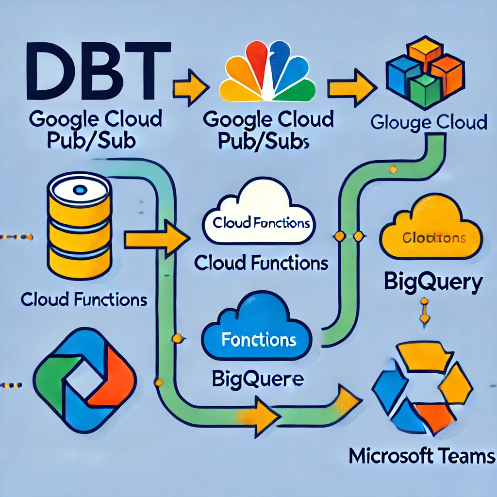

## Welcome to my Session for "Building data quality with stakeholders"


---
### 1. INTRO. Data quality is like a campfire :fire:

---
* We want people to stay and spend time on data quality... but HOW?


* How do people gather round a campfire? **Marshmallows**!


* **Marshmallows**: 
  * Data events that stakeholders really care about:
  * Example. **Anomalies** on leading indicators, which they don't have to monitor
* BUT we need to mix in **healthy snacks** = boring tests like `unique` and `not_null`

---


## 2. POLL. Let's have a Live poll to get know you!

Link: https://www.menti.com/alxmw7icd8ks
Code: 4553 5553


---

## 3. DEMO. Let's dive into some real examples!


### Types of heavily used data tests


| #   | Test type         | Example use cases       | Stakeholder interaction  |
|-----|-------------------|-------------------------|--------------------------|
| 1   | Live alerts       | 404 errors              | High                     |
| 2   | Volume changes    | Googlebot crawl volume  | Medium                   |
| 3   | Date completeness | Missing dates           | Low                      |
| 4   | dbt generic tests | not_null, unique        | None                     |

---


### Our daily data quality alert pipeline @ Bergzeit :mountain_snow:

* We use **dbt cloud** to manage models and run tests
* We store the test failures with an `on-run-end` macro `store_test_results` in BigQuery
* Listen on table updates with **Logs explorer** sink and PubSub and trigger a cloud function
* A `post_dbt_test_result` cloud function queries the `test_results` dbt model, converts the dataframe to HTML and sends it to MS teams

This is how ChatGPT visualizes the process: :-D



### How we resolve data tests with our stakeholders


* Use dbt Explore to demonstrate how to debug data tests
  - Open the affected model in dbt Explore, click on the failed test.
  - Copy the compiled test code into BigQuery and run the query:

* Looker Studio Dashboards for Data Visualization
* Rotate first response duty among data team
  - Are certain days or values noticeable? If yes, include them in the comment, along with the query.
  - If the test is only true or false, the model owner should take over.
 
* Is this the first time the fail occurred? Is there reason to believe it won't occur again and is an exception? > Wait to see if the fail occurs again.
* Is the threshold too strict? Is increasing it justifiable? > Increase the threshold.
* Unique? Would a deduplication using a qualify row_number() statement make sense? > Deduplicate.
* Is the alert even meaningful? Is there an adequate response, or is there nothing to be done? > Remove the alert and report the issue to the business owner.

---

### Best practices for improving data tests


* Route different tests into differente channels (Teams, Slack) using

```
  - dbt_expectations.expect_table_row_count_to_be_between:
      # The three cloud schedulder jobs for DACH query 350 URLs each, thus a total min amount is expected
      min_value: 900
      row_condition: "date = current_date()" # (Optional)
      strictly: false
      config:
        severity: warn
        tags: ["analytics-alerts"]
```

* use owner tags on all models

```
  - name: stg_gsc_inspection_logs
    description: >
      This model lists the search console inspection logs for a list daily tested URLs. 
      See source description for more details
    meta:
      owner: "@Chris G"
```
* use group tags for all folders as fallback for model ownership

```
census_syncs:
  +group: data_team

channel_attribution:
  +group: customer_acquisition
```

* constantly update model description to 1) provide more context, 2) describe worst case Scenarios of test failures und 3) specific resolution tests

* improve signal-to-noise ratio 


* How can I optimize the UX test alerts resolution?

# Resources: 
- dbt expectations: https://github.com/calogica/dbt-expectations


